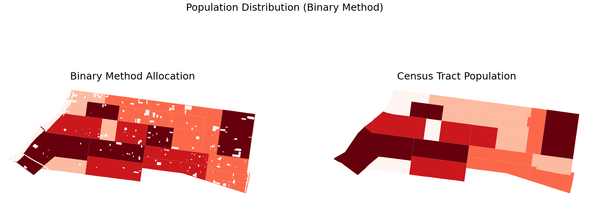
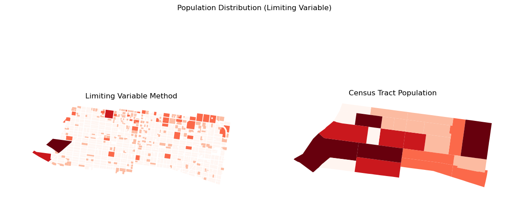
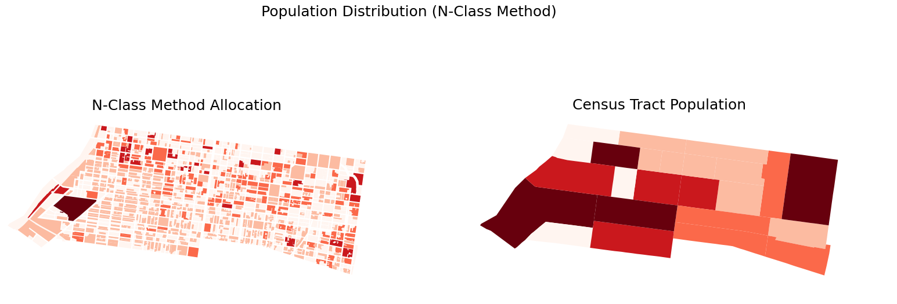

# Overview of Tobler's New Dasymetric Functions

This tutorial will cover 3 new functions added to the tobler package and can be accessed under tobler.dasymetric. The 3 functions are:
- binary_vector
- limit_variable
- percent_weighting

## Importing extensions and shapefiles

Let's suppose that we want to determine population distribution within a specific portion of the city of Philadelphia. 
We can do this with each of the 3 dasymetric functions. First, let's import all the needed extensions for this tutorial.

### Extensions

```
    import geopandas as gpd
    import matplotlib.pyplot as plt
    from tobler.dasymetric import binary_vector, limit_variable, percent_weighting
```

After importing all of our needed extensions, we can also import our shapefiles via geopandas. In the meantime, let's also set both shapefiles to the same CRS to the study area by defining our CRS ID with 
variable crs and using to_crs(). Note that all 3 functions will trigger warnings if any input shapefiles don't have matching CRS.

### Shapefiles

```
    crs = 2272
    census = gpd.read_file("Census_South/Census_South.shp").to_crs(crs)
    land_use = gpd.read_file("Land_Use_South/Land_Use_South.shp").to_crs(crs)
```

## Binary method

The first function is the binary method, referred to as binary_vector within the Tobler package. This method takes 2 vector shapefiles (a source dataframe and ancillary dataframe), using the latter 
shapefile as an exclusion zone to remove sections of the source dataframe that overlap with the exclusion zone. Polygons within an exclusion zone will revert their population fields to zero, with polygons 
located outside maintaining their population data. This method is particularly useful when trying to remove population data from certain land uses including water, transportation, or undeveloped polygons. 

In the binary_vector function, the exclusion zone can be constructed in 2 different ways. The first approach is to use the entire ancillary dataframe as an exclusion zone, removing any soource polygons that 
overlap with the exclusion zone. Another approach allows the user to construct an exclusion zone using certain parts of the ancillary dataframe instead of the entire dataset. This approach can be helpful in 
cases where numerous types of land use patterns are contained within a dataframe.

.. code-block:: python

    result = binary_vector(source_df=census,ancillary_df=land_use,population_columns="Population",exclusion_column="C_DIG1",exclusion_values=[5,7,8])

The code above is an example of how the user can utilize the binary_vector function. In the example, our census tract shapefile is used as the source dataframe, with our land use shapefile being used as the 
ancillary dataframe. The population column used is a column named "Population" that is located within the census tract shapefile. Population columns should be derived from the source dataframe, and multiple 
columns can be passed through as a list.

The final 2 parameters are dedicated for constructing the exclusion zone. The exclusion column parameter asks for a column within the ancillary dataframe, observing which rows within the exclusion column 
contain a specified exclusion value. The specified values withi exclusion_values will be used to construct the exclusion zone. In this example, we utilized "C_DIG1", a column containing the land use classes 
within Philadelphia, as our exclusion column. Values 5, 7, and 8 (Which represent transportation, water, and park polygons respectively) are used as exclusion values.

If the entire ancillary df is used as an exclusion zone, exclusion_column and exclusion_values are optional and shouldn't be used. 

After running the function, we can display the results on matplot:

```
    fig, ax = plt.subplots(1,2, figsize=(14,7))

    results.plot("Population",scheme="natural_breaks",cmap="Reds", ax=ax[0])
    census.plot("Population",scheme="natural_breaks",cmap="Reds", ax=ax[1])

    ax[0].set_title("Binary Method Allocation")
    ax[1].set_title('Census Tract Population')
    for ax in ax:
        ax.axis('off')
    fig.suptitle("Population Distribution (Binary Method)")
    plt.show()
```

 

## Limiting variable

The second function is the limiting variable method, aliased as limit_variable in the tobler package. This method's goal is to interpolate data while assigning maximum densities per area class category, which are both 
user defined, then interpolating data that do not have any restrictions. First, this method also takes a source and ancillary dataframe. It then performs an overlay of the two dataframes so that polygons that overlap within 
the zones in the source dataframe. The now intersected polygons are weighted by dividing the polygon's area by the area sum of all polygons that are contained within the same zone. 

The method then interpolates all the data that are within the user defined area-class category and therefore have a threshold. The interpolation is performed by multiplying the previously mentioned weight value by the total 
population value of the zone the polygon overlaps with. If a the interpolated value exceeds the user defined threshold, then the interpolated value of that polygon is changed to the threshold density, which is calculated by 
multiplying the threshold by the area of the polygon. Once the interpolation of polygons with thresholds is completed, the method then distributes the remainder of the population amongst the polygons that have no threshold or are an "unlimited class". 

In the code below, our source and ancillary dataframes are the census and land use shapefiles as previously used. The area class is the "C_DIG1" column in the ancillary dataframe, which in this case will be polygons with a 
land use value of 1, 2 or 3 (Which is residential, commercial, and industrial respectively). The dictionary class or 'dclass' parameter assigns the land use types with a threshold. For example, residential type polygons are 
limited to 100 population density or interpolated value. The 'cols_intp' parameter is the population column in the source dataframe that will be redistributed to overlapping polygons based on their weight. The results of the 
interpolation are housed in the 'results_intp' column.    

```
    result = limit_variable(source_df=census,ancillary_df=land_use,aclass="C_DIG1",dclass={1:100,2:50,3:50},cols_intp="Population")
```

```
    fig, ax = plt.subplots(1,2, figsize=(14,7))

    result.plot("result_intp",scheme="natural_breaks",cmap="Reds", ax=ax[0])
    census.plot("Population",scheme="natural_breaks",cmap="Reds", ax=ax[1])

    ax[0].set_title("Limiting Variable Method")
    ax[1].set_title('Census Tract Population')
    for ax in ax:
        ax.axis('off')
    fig.suptitle("Population Distribution (Limiting Variable)")
    plt.show()
```

 

## N-Class method

The third and final function is based on the n-class method, known as percent_weighting in Tobler, which allocates population data in a similar way to limiting variable. The main difference is that instead 
of specified thresholds, n-class dedicates a specific weighting in a decimal format ranging from 0 to 1 to each value. The weighting is utilized to determine the percentage of the population within a source dataframe that should 
be allocated to each polygon. This number is then further trimmed down by calculating the area of the polygon, which is then divided by the area sum of all polygons with matching values take up in each source polygon. 
Polygons with a larger area will frequently contain larger values than smaller polygons.

The standard number of specified values within n-class is normally 3 classes, however there is no specified limit on how many classes can be added within the dictionary as long as the total weighting doesn't exceed 1. In the cases 
where total_weighting is below 1, the remaining percentage is allocated to polygons not included in the dictionary.
```
    result = percent_weighting(source_df=census,ancillary_df=land_use,percent_field="C_DIG1",percent_values={1:0.85,2:0.1,5:0,7:0,8:0},population_field="Population")
```
In the above example, the assigned dictionary will allocate 85% of population data within each census tract to residential polygons, 10% to commercial polygons, and allocate zero population to transportation, park, 
and water polygons. With this dictionary, only 95% of the population data is assigned while the remaining 5% will be allocated to other polygons. In addition, a boolean parameter called "dissolve" is also utilized to 
determine whether neighboring polygons of the same value should be dissolved into 1 polygon. The option is set to True by default, and doesn't need to be specified unless the user wants to prevent the polygons from dissolving.
Users who desired more detailed results can also choose to set the dissolve option to False, especially if the ancillary dataframe contains a large number of intersecting polygons of the same value.

*Note: choosing the dissolve=False option can lead to longer processing time, especially if the dataframe is a large file size. If the user wants a quick and more generalized result, the dissolve option should remain true.

```
    fig, ax = plt.subplots(1,2, figsize=(14,7))

    results.plot("total_pop",scheme="natural_breaks",cmap="Reds", ax=ax[0])
    census.plot(scheme="natural_breaks",cmap="Reds", ax=ax[1])

    ax[0].set_title("N-Class Method Allocation")
    ax[1].set_title('Census Tract Population')
    for ax in ax:
        ax.axis('off')
    fig.suptitle("Population Distribution (N-Class Method)")
    plt.show()
```

 